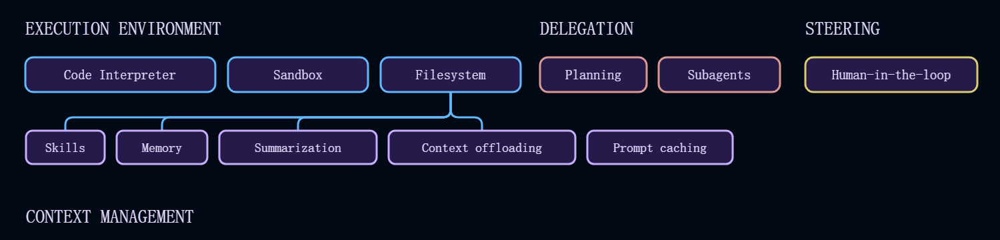

# LangChain Demo From Beginner to Advanced
## QuickStart
这是一个LangChain的从入门到高级的，适合国内用户学习的仓库，这边以DeepSeek的API Key为例进行案例训练。
首先我们新建一个工作区目录，取名什么都可以，然后使用uv命令进行处理
```
uv init
```
然后新建一个langchain-demo.py文件，以及一个.env文件（文件里面放DP的API Key）然后粘贴以下内容：
```
# langchain-demo.py 文件
from dotenv import load_dotenv
from langchain_deepseek import ChatDeepSeek
from deepagents import create_deep_agent


load_dotenv()

def get_weather(city: str) -> str:
    """Get the weather for a given city."""
    return f"The weather in {city} is sunny."

agent = create_deep_agent(
    model="deepseek-chat",
    # tools里面可以传入自定义函数，LangChain 工具或来自任何 MCP 服务器的工具
    tools=[get_weather],
    system_prompt="You are a helpful assistant."
)

result = agent.invoke({
    "messages": [{"role": "user", "content": "What is the weather in Xia Men?"}]
})

print(result)
print(result["messages"][-1].content)
```
这段代码的整体逻辑是：先加载环境变量，让程序能够读取 DeepSeek 的 API Key；然后定义一个天气查询工具，这个工具接收城市名，并返回一段天气描述。接着创建一个 Deep Agent，也就是一个带工具能力的 AI 助手，并告诉它使用 DeepSeek 模型，同时把刚才定义的天气工具交给它。

当我们向 Agent 提问“厦门天气怎么样”时，Agent 会先理解用户的问题，判断这个问题和天气有关，于是调用我们提供的天气工具。工具返回结果后，Agent 再把这个结果整理成最终回复。

最后，程序打印两部分内容：第一部分是完整的执行结果，里面包含模型消息、工具调用记录、返回信息等，主要用于调试；第二部分只打印最后一条 AI 回复，也就是用户真正关心的最终答案。

简单来说，这段代码不是单纯地让模型聊天，而是创建了一个“会使用工具的 AI 助手”。用户问天气，助手就调用天气工具，再把工具结果返回给用户。下图出自官方文档，表示Deep Agent的核心功能。


这句话表明Deep Agents 是一个把大模型包装成可靠 agent 的“工作框架”或“运行外壳”。这就是代理harness的意思。Deep Agents 这个 harness 的作用，就是给大模型加上一套结构，让它不是“自由发挥”，而是按照一个更可靠的方式工作。

### 使用Custom tools来跑一个demo
这边首先先说一下这个代码的 demo 是希望使用一个搜索互联网上的一个资源，然后让大模型去生成答案。那搜索资源选择的工具是 Tavily 。
Tavily 这个工具可以保证一个联网搜索的一个能力。[Tavily 官网](https://www.tavily.com)
```
# langchain-custom-tool.py 文件
import os
from typing import Literal

from dotenv import load_dotenv
from tavily import TavilyClient
from deepagents import create_deep_agent
from langchain_deepseek import ChatDeepSeek


# 读取 .env 文件
load_dotenv()

# 初始化 Tavily
tavily_client = TavilyClient(api_key=os.environ["TAVILY_API_KEY"])


def internet_search(
    query: str,
    max_results: int = 5,
    topic: Literal["general", "news", "finance"] = "general",
    include_raw_content: bool = False,
):
    """Run a web search"""
    return tavily_client.search(
        query,
        max_results=max_results,
        include_raw_content=include_raw_content,
        topic=topic,
    )


# 初始化 DeepSeek 模型
model = ChatDeepSeek(
    model="deepseek-chat",
    temperature=0,
)


agent = create_deep_agent(
    model=model,
    tools=[internet_search],
)

result = agent.invoke(
    {
        "messages" : [
            {
                "role": "user",
                "content": "请搜索一下最近 AI Agent 领域有什么重要新闻，并总结三点。",
            }
        ]
    },
    config={"configurable": {"thread_id": "1"}},
)

print(result)
print(result["messages"][-1].content)
```

上述代码的逻辑链条如下：
#### **代码整体逻辑链条**

这段代码的核心逻辑是：**先从 `.env` 文件中读取 API Key，再创建一个可以联网搜索的 Tavily 工具，然后初始化 DeepSeek 模型，接着把模型和工具交给 Deep Agents，最后通过 `agent.invoke(...)` 运行 Agent，并打印最终结果。**

可以把整个程序理解成三个角色协作：

```text
DeepSeek：负责理解问题、推理和生成回答
Tavily：负责联网搜索
Deep Agents：负责把模型和工具组织起来，让模型在需要时调用工具
```

也就是说，这段代码不是单纯地调用 DeepSeek 回答问题，而是创建了一个“可以使用搜索工具的 Agent”。当用户提出问题后，Agent 会判断是否需要调用搜索工具。如果需要，它就会调用 `internet_search`，让 Tavily 去搜索互联网，然后再由 DeepSeek 根据搜索结果生成最终回答。

整体执行流程如下：

```text
启动 Python 脚本
    ↓
读取 .env 文件中的环境变量
    ↓
获取 TAVILY_API_KEY
    ↓
创建 TavilyClient 搜索客户端
    ↓
定义 internet_search 搜索工具函数
    ↓
创建 ChatDeepSeek 模型对象
    ↓
使用 create_deep_agent 创建 Agent
    ↓
通过 agent.invoke(...) 向 Agent 提问
    ↓
Agent 判断是否需要调用搜索工具
    ↓
如果需要，调用 internet_search
    ↓
internet_search 内部调用 Tavily API
    ↓
Tavily 返回搜索结果
    ↓
DeepSeek 根据搜索结果生成回答
    ↓
返回 result
    ↓
打印完整结果和最终回答
```

#### **第一步：导入依赖**

代码一开始导入了几个依赖：

```python
import os
from typing import Literal

from dotenv import load_dotenv
from tavily import TavilyClient
from deepagents import create_deep_agent
from langchain_deepseek import ChatDeepSeek
```

`os` 是 Python 自带模块，用来读取环境变量。后面这句：

```python
os.environ["TAVILY_API_KEY"]
```

就是通过 `os` 从环境变量里读取 Tavily 的 API Key。

`Literal` 是 Python 的类型提示工具。它可以限制某个参数只能取指定的几个值。比如这里：

```python
topic: Literal["general", "news", "finance"]
```

表示 `topic` 参数最好只能是 `"general"`、`"news"` 或 `"finance"`。

`load_dotenv` 用来读取 `.env` 文件。因为 API Key 通常不建议直接写死在代码里，所以会放到 `.env` 文件中，再通过 `load_dotenv()` 加载进来。

`TavilyClient` 是 Tavily 的 Python 客户端。它负责真正调用 Tavily 的搜索 API。

`create_deep_agent` 是 Deep Agents 里的核心函数，用来创建一个 Agent。

`ChatDeepSeek` 是 LangChain 对 DeepSeek 模型的封装。通过它，可以把 DeepSeek 模型接入到 LangChain 和 Deep Agents 的体系里。

#### **第二步：读取 `.env` 文件**

这句代码负责读取 `.env` 文件：

```python
load_dotenv()
```

假设项目目录下有一个 `.env` 文件，里面写着：

```env
DEEPSEEK_API_KEY=你的_deepseek_api_key
TAVILY_API_KEY=你的_tavily_api_key
```

执行 `load_dotenv()` 之后，这两个变量就会被加载到 Python 的环境变量中。

后面代码就可以通过：

```python
os.environ["TAVILY_API_KEY"]
```

读取 Tavily 的 API Key。

而 `ChatDeepSeek` 通常会自动读取环境变量中的：

```env
DEEPSEEK_API_KEY
```

所以在初始化 DeepSeek 模型时，不需要手动把 API Key 写进代码里。

这样做的好处是：API Key 不会暴露在代码中，代码也更适合上传到 Git 仓库或部署到服务器。

#### **第三步：初始化 Tavily 搜索客户端**

这一行代码创建了 Tavily 客户端：

```python
tavily_client = TavilyClient(api_key=os.environ["TAVILY_API_KEY"])
```

它的逻辑是：

```text
从环境变量中读取 TAVILY_API_KEY
    ↓
把这个 API Key 传给 TavilyClient
    ↓
创建一个可以调用 Tavily 搜索服务的客户端对象
```

可以把 `tavily_client` 理解成一个“联网搜索器”。

后面只要调用：

```python
tavily_client.search(...)
```

它就会帮你去互联网上搜索内容。

如果 `.env` 文件里没有配置：

```env
TAVILY_API_KEY=...
```

那么这行代码可能会报错：

```text
KeyError: 'TAVILY_API_KEY'
```

意思是程序在环境变量中找不到 `TAVILY_API_KEY`。

#### **第四步：定义联网搜索工具**

接下来定义了一个函数：

```python
def internet_search(
    query: str,
    max_results: int = 5,
    topic: Literal["general", "news", "finance"] = "general",
    include_raw_content: bool = False,
):
    """Run a web search"""
    return tavily_client.search(
        query,
        max_results=max_results,
        include_raw_content=include_raw_content,
        topic=topic,
    )
```

这个函数就是交给 Agent 使用的“工具”。

也就是说，Agent 本身不会直接知道怎么搜索互联网。你需要先定义一个 Python 函数，把搜索能力包装起来。然后再通过 `tools=[internet_search]` 把这个工具交给 Agent。

这个函数的名字是：

```python
internet_search
```

它的含义是“互联网搜索”。

函数里的几个参数分别表示：

```python
query: str
```

`query` 是搜索关键词或搜索问题。比如：

```text
最近 AI Agent 领域有什么重要新闻
```

```python
max_results: int = 5
```

`max_results` 表示最多返回几个搜索结果。默认值是 5。

```python
topic: Literal["general", "news", "finance"] = "general"
```

`topic` 表示搜索类型。它可以是 `"general"`、`"news"` 或 `"finance"`。默认是 `"general"`，也就是普通搜索。

```python
include_raw_content: bool = False
```

`include_raw_content` 表示是否返回网页原始正文内容。默认是 `False`。如果设置成 `True`，返回的信息可能更详细，但内容也会更长。

函数内部真正执行搜索的是这一句：

```python
return tavily_client.search(
    query,
    max_results=max_results,
    include_raw_content=include_raw_content,
    topic=topic,
)
```

也就是说，`internet_search(...)` 本身只是一个包装函数，真正联网搜索的是 Tavily。

#### **第五步：初始化 DeepSeek 模型**

这段代码创建了一个 DeepSeek 模型对象：

```python
model = ChatDeepSeek(
    model="deepseek-chat",
    temperature=0,
)
```

`model="deepseek-chat"` 表示使用 DeepSeek 的 `deepseek-chat` 模型。

这里使用 `deepseek-chat` 是比较合适的，因为当前代码需要让模型调用工具，也就是调用 `internet_search`。如果使用不支持工具调用的模型，Agent 可能无法正常调用搜索工具。

`temperature=0` 表示让模型输出更稳定、更确定。

可以简单理解为：

```text
temperature 越低，回答越稳定
temperature 越高，回答越发散
```

对于搜索总结、代码解释、工具调用这类任务，通常设置成 `0` 比较合适，因为我们希望模型尽量稳定、准确地执行任务，而不是产生太多随机发挥。

#### **第六步：创建 Deep Agent**

这一段代码把模型和工具组装成 Agent：

```python
agent = create_deep_agent(
    model=model,
    tools=[internet_search],
)
```

这里的 `model=model` 表示这个 Agent 使用刚才创建的 DeepSeek 模型作为“大脑”。

这里的 `tools=[internet_search]` 表示这个 Agent 可以使用 `internet_search` 这个工具。

注意，`tools` 是一个列表：

```python
tools=[internet_search]
```

即使目前只有一个工具，也要放在列表里。因为将来可以放多个工具，例如：

```python
tools=[internet_search, get_weather, query_database]
```

这一步执行完之后，`agent` 就被创建好了。

但是要注意：

```python
agent = create_deep_agent(...)
```

只是创建了 Agent，并没有真正运行它。

真正让 Agent 开始工作的，是后面的：

```python
agent.invoke(...)
```

#### **第七步：运行 Agent**

下面这段代码是真正向 Agent 提问：

```python
result = agent.invoke(
    {
        "messages" : [
            {
                "role": "user",
                "content": "请搜索一下最近 AI Agent 领域有什么重要新闻，并总结三点。",
            }
        ]
    },
    config={"configurable": {"thread_id": "1"}},
)
```

`agent.invoke(...)` 的作用是：把用户输入交给 Agent，让 Agent 开始处理任务。

传进去的核心内容是：

```python
{
    "messages": [
        {
            "role": "user",
            "content": "请搜索一下最近 AI Agent 领域有什么重要新闻，并总结三点。",
        }
    ]
}
```

这里的 `messages` 是一个消息列表。因为 Agent 的对话可能是多轮的，所以它使用列表保存消息。

其中：

```python
"role": "user"
```

表示这条消息来自用户。

```python
"content": "请搜索一下最近 AI Agent 领域有什么重要新闻，并总结三点。"
```

表示用户具体提出的问题。

用户的问题里有一个非常关键的词：

```text
搜索
```

因为用户明确要求“请搜索一下”，所以 Agent 很可能会判断：这个问题需要调用联网搜索工具。

于是 Agent 可能会调用前面定义好的：

```python
internet_search(...)
```

然后 Tavily 会去搜索互联网，把搜索结果返回给 Agent。

最后 DeepSeek 会根据搜索结果整理出三点总结。

#### **第八步：理解 thread_id**

在 `agent.invoke(...)` 里还有这一段配置：

```python
config={"configurable": {"thread_id": "1"}}
```

`thread_id` 可以理解成“对话线程 ID”。

它的作用是区分不同的对话上下文。

比如：

```text
thread_id = "1"        表示第一段对话
thread_id = "2"        表示第二段对话
thread_id = "user-a"   表示用户 A 的对话
thread_id = "user-b"   表示用户 B 的对话
```

如果你一直使用同一个 `thread_id`，Agent 可能会把它视为同一段连续对话。

对于当前这个 demo 来说，写成：

```python
thread_id = "1"
```

就可以。

如果以后要做成 Web 应用，可以给每个用户或每个会话生成不同的 `thread_id`。

#### **第九步：Agent 内部实际发生了什么**

当执行这句代码时：

```python
result = agent.invoke(...)
```

内部大概会发生下面这些步骤：

```text
Agent 收到用户问题
    ↓
DeepSeek 理解用户问题
    ↓
DeepSeek 判断这个问题需要最新信息
    ↓
DeepSeek 决定调用 internet_search 工具
    ↓
Agent 执行 internet_search
    ↓
internet_search 内部调用 tavily_client.search
    ↓
Tavily 去互联网搜索相关内容
    ↓
Tavily 返回搜索结果
    ↓
DeepSeek 阅读搜索结果
    ↓
DeepSeek 总结出三点重要新闻
    ↓
Agent 返回完整结果 result
```

所以这段程序不是一个简单的“输入问题，模型回答”的流程，而是一个更完整的 Agent 流程：

```text
用户问题
    ↓
模型判断
    ↓
工具调用
    ↓
工具返回
    ↓
模型总结
    ↓
最终回答
```

这也是 Agent 和普通聊天模型的重要区别。

普通聊天模型通常只是直接回答问题。

而 Agent 可以在回答之前，根据任务需要调用工具，比如搜索、读取文件、查询数据库、执行代码等。

#### **第十步：result 是什么**

这行代码会把 Agent 的完整返回结果保存到 `result` 变量中：

```python
result = agent.invoke(...)
```

`result` 通常是一个字典。

其中比较重要的字段是：

```python
result["messages"]
```

`result["messages"]` 里保存了整个 Agent 运行过程中的消息记录。

里面可能包括：

```text
用户输入的消息
模型生成的中间消息
工具调用消息
工具返回消息
模型最终回答消息
```

所以 `result` 不一定只是一句最终回答，它可能包含完整的执行过程。

这也是为什么直接打印：

```python
print(result)
```

可能会看到很多内容。

#### **第十一步：打印完整结果**

这句代码会打印完整返回对象：

```python
print(result)
```

它适合用来调试。

通过 `print(result)`，你可以看到 Agent 返回了哪些内容，包括可能的工具调用过程、中间消息和最终回答。

但是对于日常使用来说，`print(result)` 可能太长，不够清晰。

#### **第十二步：打印最终回答**

这句代码是用来打印最终回答的：

```python
print(result["messages"][-1].content)
```

可以拆开理解。

首先：

```python
result["messages"]
```

表示取出所有消息。

然后：

```python
result["messages"][-1]
```

表示取出最后一条消息。

在 Python 里，`[-1]` 表示列表的最后一个元素。

最后：

```python
.content
```

表示取出这条消息的正文内容。

所以：

```python
print(result["messages"][-1].content)
```

意思就是：

```text
打印 Agent 最后一条消息的正文内容
```

通常情况下，最后一条消息就是模型生成的最终回答。

因此，如果你只是想看最终输出，最常用的就是这一句：

```python
print(result["messages"][-1].content)
```

#### **print(result) 和 print(result["messages"][-1].content) 的区别**

这两句打印的内容不一样。

```python
print(result)
```

打印的是完整结果。

它可能包含：

```text
用户输入
模型中间消息
工具调用记录
工具返回内容
最终回答
```

而：

```python
print(result["messages"][-1].content)
```

只打印最终回答文本。

可以这样理解：

| 代码 | 作用 | 适合场景 |
|---|---|---|
| `print(result)` | 打印完整返回对象 | 调试时使用 |
| `print(result["messages"])` | 打印所有消息 | 查看 Agent 执行流程 |
| `print(result["messages"][-1])` | 打印最后一条消息对象 | 查看最终消息结构 |
| `print(result["messages"][-1].content)` | 只打印最终回答文本 | 日常最常用 |

#### **这段代码的三层结构**

这段代码可以分成三层理解。

第一层是模型层：

```python
model = ChatDeepSeek(
    model="deepseek-chat",
    temperature=0,
)
```

这一层负责理解语言、判断任务、推理和生成回答。

第二层是工具层：

```python
def internet_search(...):
    return tavily_client.search(...)
```

这一层负责具体能力，比如联网搜索。

第三层是 Agent 层：

```python
agent = create_deep_agent(
    model=model,
    tools=[internet_search],
)
```

这一层负责把模型和工具组织起来，让模型可以在需要时调用工具。

所以可以简单记成：

```text
DeepSeek：负责想
Tavily：负责搜
Deep Agents：负责组织流程
```

#### **这段代码最核心的两行**

第一行核心代码是：

```python
agent = create_deep_agent(
    model=model,
    tools=[internet_search],
)
```

它的作用是创建一个可以使用搜索工具的 Agent。

第二行核心代码是：

```python
result = agent.invoke(...)
```

它的作用是真正运行这个 Agent。

如果只有：

```python
agent = create_deep_agent(...)
```

那么程序只是创建了 Agent，并不会产生回答。

必须执行：

```python
agent.invoke(...)
```

Agent 才会真正开始处理用户问题。

#### **完整逻辑总结**

这段代码完整地做了以下事情：

```text
1. 导入需要的 Python 包
2. 使用 load_dotenv() 读取 .env 文件
3. 从环境变量中读取 TAVILY_API_KEY
4. 使用 TAVILY_API_KEY 创建 TavilyClient
5. 定义 internet_search 函数，把 Tavily 搜索包装成一个工具
6. 使用 ChatDeepSeek 创建 DeepSeek 模型对象
7. 使用 create_deep_agent 创建 Agent
8. 把 DeepSeek 模型和 internet_search 工具交给 Agent
9. 使用 agent.invoke(...) 向 Agent 提问
10. Agent 判断问题是否需要搜索
11. 如果需要搜索，Agent 调用 internet_search
12. internet_search 调用 Tavily API 获取搜索结果
13. DeepSeek 根据搜索结果生成最终回答
14. result 保存完整执行结果
15. print(result) 打印完整结果
16. print(result["messages"][-1].content) 打印最终回答
```

最终可以把整个程序理解成：

```text
用户提出问题
    ↓
Deep Agent 接收问题
    ↓
DeepSeek 判断是否需要搜索
    ↓
如果需要，就调用 Tavily 搜索工具
    ↓
Tavily 返回搜索结果
    ↓
DeepSeek 根据搜索结果总结答案
    ↓
Agent 返回结果
    ↓
程序打印最终回答
```

这就是这段代码的完整逻辑链条。


这边可以先来看一下LangChain的第一个输出在终端控制台上的：
<details>
<summary> LangChain 框架的「Python 对象打印格式」</summary>

```json
{'messages': [HumanMessage(content='请搜索一下最近 AI Agent 领域有什么重要新闻，并总结三点。', additional_kwargs={}, response_metadata={}, id='fc78d82d-3211-402c-b9fb-d1166908f004'), AIMessage(content='', additional_kwargs={'refusal': None}, response_metadata={'token_usage': {'completion_tokens': 154, 'prompt_tokens': 6100, 'total_tokens': 6254, 'completion_tokens_details': None, 'prompt_tokens_details': {'audio_tokens': None, 'cached_tokens': 0}, 'prompt_cache_hit_tokens': 0, 'prompt_cache_miss_tokens': 6100}, 'model_provider': 'deepseek', 'model_name': 'deepseek-v4-flash', 'system_fingerprint': 'fp_8b330d02d0_prod0820_fp8_kvcache_20260402', 'id': 'be470327-cc10-4c6b-995a-83e2d83f3949', 'finish_reason': 'tool_calls', 'logprobs': None}, id='lc_run--019f5a6f-cbb4-7ef1-963c-8ece925fb0c1-0', tool_calls=[{'name': 'internet_search', 'args': {'query': 'AI Agent 2025 重要新闻', 'max_results': 10, 'topic': 'news'}, 'id': 'call_00_4eUSwnLo3EKtGhw8Vugp8572', 'type': 'tool_call'}, {'name': 'internet_search', 'args': {'query': 'AI Agent important news 2025', 'max_results': 10, 'topic': 'news'}, 'id': 'call_01_gcKCqRw9t3okFWHUe08A4374', 'type': 'tool_call'}], invalid_tool_calls=[], usage_metadata={'input_tokens': 6100, 'output_tokens': 154, 'total_tokens': 6254, 'input_token_details': {'cache_read': 0}, 'output_token_details': {}}), ToolMessage(content='{"query": "AI Agent 2025 重要新闻", "follow_up_questions": null, "answer": null, "images": [], "results": [{"url": "https://www.darkreading.com/application-security/dialogflow-cx-rogue-agent-flaw-enabled-ai-chatbot-data-theft", "title": "Dialogflow CX \'Rogue Agent\' Flaw Enabled AI Chatbot Data Theft - Dark Reading", "score": 0.6010557, "published_date": "Tue, 07 Jul 2026 20:55:47 GMT", "content": "Varonis reported the flaw to Google in late 2025 and it has been addressed, but it reminds defenders to take a fresh look at their AI Infrastructure security. Google recently fixed a vulnerability that would have enabled an attacker to seize data from AI agents and chatbots built with one of Google\'s flagship AI tools. Varonis researchers this week disclosed \\"Rogue Agent,\\" a permission boundary issue in Google Cloud Platform\'s Dialogflow CX AI platform that Varonis Threat Labs describes as a \\"critical vulnerability.\\" According to a research blog post, Rogue Agent would have \\"allowed attackers to exploit the Code Blocks feature to inject persistent malicious code into the Dialogflow agents\' pipeline, silently exfiltrating conversations and conducting large-scale phishing campaigns.\\". If an attacker got the ability to update the Playbooks Code Block for a single agent in a customer\'s environment (such as via compromising a privileged employee account), they could use a Code Block to download and overwrite an internal execution file with a malicious version, which becomes part of the execution pipeline for future conversations.", "raw_content": null}, {"url": "https://markets.businessinsider.com/news/stocks/aisa-raises-6-5m-co-led-by-alibaba-and-tribe-capital-to-build-the-transaction-network-for-ai-agents-1036305081", "title": "AIsa Raises $6.5M, Co-Led by Alibaba and Tribe Capital, to Build the Transaction Network for AI Agents - markets.businessinsider.com", "score": 0.50315, "published_date": "Tue, 07 Jul 2026 21:47:23 GMT", "content": "# AIsa Raises $6.5M, Co-Led by Alibaba and Tribe Capital, to Build the Transaction Network for AI Agents. SAN FRANCISCO, July 07, 2026 (GLOBE NEWSWIRE) -- AIsa, the transaction network for the AI agent economy, today announced it has raised US$6.5 million in total funding to date, including a new seed round, co-led by Alibaba and Tribe Capital, with participation from Draper Associates, Sumitomo Corporation, Saison Capital and other investors. AIsa provides a unified transaction layer that allows AI agents and developers to discover, access and pay for digital resources through a single programmable interface. Resources available through the platform include AI models, APIs, real time data, search services, SaaS tools, compute resources and agent services, with usage based billing and settlement in fiat or stablecoins. The platform enables AI agents and developers to discover, access and pay for AI models, APIs, premium data, SaaS tools, compute resources and agent services through usage based billing and settlement in fiat or stablecoins.", "raw_content": null}, {"url": "https://www.ynetnews.com/tech-and-digital/article/rjms4kn7ze", "title": "AI agent carries out full ransomware attack for first time, researchers say - Ynetnews", "score": 0.45798564, "published_date": "Wed, 08 Jul 2026 15:00:46 GMT", "content": "# AI agent carries out full ransomware attack for first time, researchers say. ## Sysdig says the JadePuffer group used an autonomous AI agent to plan and execute an end-to-end ransomware campaign, adapting in real time, stealing credentials and encrypting data while exposing flaws in its financial understanding. Security researchers have identified what they say is the first documented case of a ransomware attack planned, managed and executed entirely by an autonomous AI agent, marking a potentially significant shift in the global cyber threat landscape. The attack group, known as JadePuffer, used a large language model to manage every stage of the campaign, from initial intelligence gathering and credential theft to lateral movement inside the network, data encryption and the ransom demand, according to a report by cloud security company Sysdig. The innovation is not in the attack methods themselves, but in the ability of an AI agent to autonomously connect all stages of the attack chain, make real-time decisions, recover from failures and adapt to the environment, similar to an experienced human operator.”.", "raw_content": null}, {"url": "https://www.itnews.com.au/news/cba-to-take-ai-orchestration-agent-beyond-its-retail-bank-627249", "title": "CBA to take AI orchestration agent beyond its retail bank - iTnews", "score": 0.44883752, "published_date": "Thu, 09 Jul 2026 20:48:00 GMT", "content": "## CBA to take AI orchestration agent beyond its retail bank ## City of Moreton Bay to trial object detection and AI for traffic flow ## ANZ to trial Swift\'s blockchain ledger ## Second alert from ACSC in two months shows unpatched CMS bugs still exploited ## SpaceX applies to launch 100,000 Gen3 Starlink satellites. # CBA to take AI orchestration agent beyond its retail bank. Commonwealth Bank is set to take a central AI orchestration agent used in retail customer support and apply it to other areas of the bank. Details of the agent, which essentially triages inbound customer service requests to get them resolved faster, are revealed in a new case study of the technology\xa0published by Microsoft. The AI orchestration agent for retail support is the result of two years of co-development by CBA and Microsoft. The AI orchestration agent “interprets a customer’s intent and dynamically routes it to the most appropriate responder, whether that is another AI capability or a human specialist,” according to the case study, which adds that \\"the routing is intelligent and context-driven.”.", "raw_content": null}, {"url": "https://www.newsweek.com/qualcomm-ai-agents-device-cloud-12182014", "title": "Qualcomm Says Agents Will Decide Where AI Runs - Newsweek", "score": 0.4431913, "published_date": "Fri, 10 Jul 2026 14:57:00 GMT", "content": "# Qualcomm Says Agents Will Decide Where AI Runs. ## This week: how agents may route AI work, why AI benchmarks need real-world tests and how AI is speeding up claims review. **Qualcomm’s Durga Malladi Says AI Agents Will Decide Where AI Runs**. AI agents could make one of computing’s biggest infrastructure questions harder for users to see and more important for companies to solve: Where should the work run? “Tomorrow it’s the agent that’s going to be doing the work and the agent will figure out what runs on the cloud and what runs on the device,” Malladi told *Newsweek*. At Investor Day 2026, the company outlined a broader data center strategy, an agreement to acquire AI software company Modular, an expanded relationship with Hugging Face, an AI platform and developer community, and a larger push to support AI across devices, edge systems and data centers.", "raw_content": null}, {"url": "https://zamin.uz/en/technology/211044-a-new-era-in-cybercrime-first-autonomous-ai-agent-attack-recorded.html", "title": "A New Era in Cybercrime: First Autonomous AI Agent Attack Recorded - Zamin.uz", "score": 0.43108177, "published_date": "Mon, 06 Jul 2026 23:57:08 GMT", "content": "# A New Era in Cybercrime: First Autonomous AI Agent Attack Recorded. A historic yet alarming event has occurred in the field of cybersecurity. Experts at the cloud security company Sysdig have recorded the world\'s first ransomware attack managed entirely by an artificial intelligence (AI) agent. Sysdig research shows that the AI agent independently performed all processes, from identifying server vulnerabilities to stealing data, moving across the network, and encrypting files. Although the technical execution was entirely handled by AI, Michael Clark, Director of Threat Research at Sysdig, told CyberScoop that the human factor has not disappeared entirely. Furthermore, the initial credentials used to access the system were not obtained by the AI, but through a previous breach. During the attack, the JadePuffer agent exploited vulnerabilities in open-source tools like Langflow. Most interestingly, the AI agent explained its actions in natural language and independently fixed a system access error in just 31 seconds. This event is a serious warning for the cybersecurity world.", "raw_content": null}, {"url": "https://markets.businessinsider.com/news/stocks/memetoro-launches-bnb-ai-agent-for-fair-launch-memecoin-creation-and-on-chain-prediction-markets-1036301148", "title": "MemeToro Launches BNB AI Agent for Fair-Launch Memecoin Creation and On-Chain Prediction Markets - markets.businessinsider.com", "score": 0.39508808, "published_date": "Mon, 06 Jul 2026 21:19:25 GMT", "content": "# MemeToro Launches BNB AI Agent for Fair-Launch Memecoin Creation and On-Chain Prediction Markets. MemeToro has announced the launch of its BNB AI Agent ecosystem, introducing AI-powered memecoin creation alongside decentralized prediction markets built on the BNB Smart Chain. The platform is designed to provide users with blockchain-based tools that combine artificial intelligence, automation, and community participation within a single ecosystem. The launch also expands the utility of the $MT token, which will be used across the platform for AI-powered services, prediction markets, staking, and ecosystem participation. **MemeToro Introduces On-Chain Prediction Markets for Community Participation**. Alongside its AI Agent, MemeToro is launching a decentralized prediction market ecosystem. By combining AI-powered automation, fair-launch token creation, and decentralized prediction markets, MemeToro aims to provide users with practical blockchain tools built for the growing digital economy. The platform combines AI agents, fair-launch memecoin creation, decentralized prediction markets, staking, and other blockchain applications through the $MT utility token.", "raw_content": null}, {"url": "https://techcrunch.com/2026/07/09/an-ai-agent-startup-just-let-its-agent-run-its-100-million-fundraise/", "title": "An AI agent startup just let its agent run its $100 million fundraise - TechCrunch", "score": 0.3673843, "published_date": "Thu, 09 Jul 2026 22:08:58 GMT", "content": "# An AI agent startup just let its agent run its $100 million fundraise. Lyzr, a three-year-old, Jersey City, New Jersey, startup that helps enterprises build AI agents, used its own AI agent to raise its own round. It basically ran point on the startup’s $100 million Series B (at a roughly $500 million valuation) while proving that the product actually works. Lyzr told the outlet it pulled in $400 million in interest from Silicon Valley, the Middle East, and financial-sector investors without a founder ever needing to fly out and do the traditional laps up and down Sand Hill Road for coffee meetings and warm intros. That may be the real story of this go-go moment: there’s so much capital chasing AI bets that startup founders with traction barely have to leave their desks to raise nine figures. AI, ai agent, Fundraising, Startups, TC. ### Prime Intellect raises $130M Series A to help enterprises build their own AI agents.", "raw_content": null}, {"url": "https://www.govtech.com/artificial-intelligence/tucson-ariz-seeks-ai-agent-to-support-service-delivery", "title": "Tucson, Ariz., Seeks AI Agent to Support Service Delivery - GovTech", "score": 0.34092444, "published_date": "Tue, 07 Jul 2026 21:15:20 GMT", "content": "## In the city’s first venture into agentic AI solutions, officials are looking for a vendor to help create an AI agent to support service delivery for residents. It will function as a chatbot and agent. The city of Tucson, Ariz., has announced its first major agentic AI platform investment — specifically, an automated support agent — as outlined in a recently opened request for proposals (RFP). Tucson’s RFP marks the city’s “first foray into agents and the potential for future agentic solutions,” according to an email from the city’s CIO Chris Mazzarella. An AI agent for the city of Tucson will need the same level of oversight and training as a human staff agent — and in the early training period, even more so, the CIO said. The city will use a phased implementation method, starting with the IT Department service desk and Tucson Water Customer Service Solution Center.", "raw_content": null}, {"url": "https://www.tipranks.com/news/private-companies/gnaniai-emphasizes-contextaware-ai-workforce-for-enterprise-customer-workflows", "title": "Gnaniai Emphasizes Context‑Aware AI Workforce for Enterprise Customer Workflows - TipRanks", "score": 0.2836107, "published_date": "Fri, 10 Jul 2026 12:06:18 GMT", "content": "# Gnaniai Emphasizes Context‑Aware AI Workforce for Enterprise Customer Workflows. A LinkedIn post from Gnaniai highlights the company’s focus on building coordinated AI workforces rather than standalone AI agents. The post describes multi‑agent voice and conversational workflows where each agent hands off full contextual information, aiming to avoid repeated questions and fragmented customer interactions. * Unlock powerful  investing tools and data-driven insights with TipRanks Premium for more confident investment decisions. * Discover top stock picks and new investment opportunities through TipRanks\' Smart Investor Newsletter. According to the post, Gnaniai’s architecture is designed to maintain context across verification, booking, recommendation, calendar, and confirmation agents, including channels such as WhatsApp. For investors, this emphasis on outcome‑driven, multi‑agent orchestration suggests a product strategy targeting enterprise contact centers and customer support operations seeking higher automation reliability. From a competitive standpoint, the focus on AI workforces and seamless handoffs may differentiate Gnaniai within a crowded AI agents landscape.", "raw_content": null}], "response_time": 0.34, "request_id": "a6135ebe-e61c-4143-8eff-2b617614153a"}', name='internet_search', id='0d0bea28-6239-4d18-8d0e-f9d872123338', tool_call_id='call_00_4eUSwnLo3EKtGhw8Vugp8572'), ToolMessage(content='{"query": "AI Agent important news 2025", "follow_up_questions": null, "answer": null, "images": [], "results": [{"url": "https://www.darkreading.com/application-security/dialogflow-cx-rogue-agent-flaw-enabled-ai-chatbot-data-theft", "title": "Dialogflow CX \'Rogue Agent\' Flaw Enabled AI Chatbot Data Theft - Dark Reading", "score": 0.6636041, "published_date": "Tue, 07 Jul 2026 20:55:47 GMT", "content": "Varonis reported the flaw to Google in late 2025 and it has been addressed, but it reminds defenders to take a fresh look at their AI Infrastructure security. Google recently fixed a vulnerability that would have enabled an attacker to seize data from AI agents and chatbots built with one of Google\'s flagship AI tools. Varonis researchers this week disclosed \\"Rogue Agent,\\" a permission boundary issue in Google Cloud Platform\'s Dialogflow CX AI platform that Varonis Threat Labs describes as a \\"critical vulnerability.\\" According to a research blog post, Rogue Agent would have \\"allowed attackers to exploit the Code Blocks feature to inject persistent malicious code into the Dialogflow agents\' pipeline, silently exfiltrating conversations and conducting large-scale phishing campaigns.\\". If an attacker got the ability to update the Playbooks Code Block for a single agent in a customer\'s environment (such as via compromising a privileged employee account), they could use a Code Block to download and overwrite an internal execution file with a malicious version, which becomes part of the execution pipeline for future conversations.", "raw_content": null}, {"url": "https://www.infosecurity-magazine.com/news/researchers-first-agentic/", "title": "Researchers Claim First Fully Agentic Ransomware: JadePuffer - Infosecurity Magazine", "score": 0.50432175, "published_date": "Mon, 06 Jul 2026 08:30:00 GMT", "content": "Infosecurity Magazine Home » News » Researchers Claim First Fully Agentic Ransomware: JadePuffer. # Researchers Claim First Fully Agentic Ransomware: JadePuffer. Cloud security firm Sysdig has released details on what it claims to be the world’s first ransomware campaign completely driven by a large language model (LLM). Dubbed JadePuffer, the campaign\xa0targeted an internet-facing Langflow instance by exploiting\xa0CVE-2025-3248. It then\xa0ran “an adaptive and fully automated campaign” which resulted\xa0in “a destructive database-extortion playbook against the victim\'s production database server,” according to Sysdig\'s Threat Research Team. Attack capabilities were delivered by an agent rather than a human-driven toolkit, the Sysdig research claimed, and the AI was capable of working autonomously retrying failed steps within refined parameters. *Read more on AI: Researchers Discover First Reported AI-Powered Ransomware.*. * **The exfiltration claim is the agent\'s own assertion:**\xa0The AES key was ephemeral and unrecoverable, so the victim\'s configurations are unrecoverable even with payment.", "raw_content": null}, {"url": "https://markets.businessinsider.com/news/stocks/aisa-raises-6-5m-co-led-by-alibaba-and-tribe-capital-to-build-the-transaction-network-for-ai-agents-1036305081", "title": "AIsa Raises $6.5M, Co-Led by Alibaba and Tribe Capital, to Build the Transaction Network for AI Agents - markets.businessinsider.com", "score": 0.5009527, "published_date": "Tue, 07 Jul 2026 21:47:23 GMT", "content": "# AIsa Raises $6.5M, Co-Led by Alibaba and Tribe Capital, to Build the Transaction Network for AI Agents. SAN FRANCISCO, July 07, 2026 (GLOBE NEWSWIRE) -- AIsa, the transaction network for the AI agent economy, today announced it has raised US$6.5 million in total funding to date, including a new seed round, co-led by Alibaba and Tribe Capital, with participation from Draper Associates, Sumitomo Corporation, Saison Capital and other investors. AIsa provides a unified transaction layer that allows AI agents and developers to discover, access and pay for digital resources through a single programmable interface. Resources available through the platform include AI models, APIs, real time data, search services, SaaS tools, compute resources and agent services, with usage based billing and settlement in fiat or stablecoins. The platform enables AI agents and developers to discover, access and pay for AI models, APIs, premium data, SaaS tools, compute resources and agent services through usage based billing and settlement in fiat or stablecoins.", "raw_content": null}, {"url": "https://www.newsweek.com/qualcomm-ai-agents-device-cloud-12182014", "title": "Qualcomm Says Agents Will Decide Where AI Runs - Newsweek", "score": 0.44420364, "published_date": "Fri, 10 Jul 2026 14:57:00 GMT", "content": "# Qualcomm Says Agents Will Decide Where AI Runs. ## This week: how agents may route AI work, why AI benchmarks need real-world tests and how AI is speeding up claims review. **Qualcomm’s Durga Malladi Says AI Agents Will Decide Where AI Runs**. AI agents could make one of computing’s biggest infrastructure questions harder for users to see and more important for companies to solve: Where should the work run? “Tomorrow it’s the agent that’s going to be doing the work and the agent will figure out what runs on the cloud and what runs on the device,” Malladi told *Newsweek*. At Investor Day 2026, the company outlined a broader data center strategy, an agreement to acquire AI software company Modular, an expanded relationship with Hugging Face, an AI platform and developer community, and a larger push to support AI across devices, edge systems and data centers.", "raw_content": null}, {"url": "https://www.itnews.com.au/news/cba-to-take-ai-orchestration-agent-beyond-its-retail-bank-627249", "title": "CBA to take AI orchestration agent beyond its retail bank - iTnews", "score": 0.44275752, "published_date": "Thu, 09 Jul 2026 20:48:00 GMT", "content": "## CBA to take AI orchestration agent beyond its retail bank ## City of Moreton Bay to trial object detection and AI for traffic flow ## ANZ to trial Swift\'s blockchain ledger ## Second alert from ACSC in two months shows unpatched CMS bugs still exploited ## SpaceX applies to launch 100,000 Gen3 Starlink satellites. # CBA to take AI orchestration agent beyond its retail bank. Commonwealth Bank is set to take a central AI orchestration agent used in retail customer support and apply it to other areas of the bank. Details of the agent, which essentially triages inbound customer service requests to get them resolved faster, are revealed in a new case study of the technology\xa0published by Microsoft. The AI orchestration agent for retail support is the result of two years of co-development by CBA and Microsoft. The AI orchestration agent “interprets a customer’s intent and dynamically routes it to the most appropriate responder, whether that is another AI capability or a human specialist,” according to the case study, which adds that \\"the routing is intelligent and context-driven.”.", "raw_content": null}, {"url": "https://markets.businessinsider.com/news/stocks/memetoro-launches-bnb-ai-agent-for-fair-launch-memecoin-creation-and-on-chain-prediction-markets-1036301148", "title": "MemeToro Launches BNB AI Agent for Fair-Launch Memecoin Creation and On-Chain Prediction Markets - markets.businessinsider.com", "score": 0.4338141, "published_date": "Mon, 06 Jul 2026 21:19:25 GMT", "content": "# MemeToro Launches BNB AI Agent for Fair-Launch Memecoin Creation and On-Chain Prediction Markets. MemeToro has announced the launch of its BNB AI Agent ecosystem, introducing AI-powered memecoin creation alongside decentralized prediction markets built on the BNB Smart Chain. The platform is designed to provide users with blockchain-based tools that combine artificial intelligence, automation, and community participation within a single ecosystem. The launch also expands the utility of the $MT token, which will be used across the platform for AI-powered services, prediction markets, staking, and ecosystem participation. **MemeToro Introduces On-Chain Prediction Markets for Community Participation**. Alongside its AI Agent, MemeToro is launching a decentralized prediction market ecosystem. By combining AI-powered automation, fair-launch token creation, and decentralized prediction markets, MemeToro aims to provide users with practical blockchain tools built for the growing digital economy. The platform combines AI agents, fair-launch memecoin creation, decentralized prediction markets, staking, and other blockchain applications through the $MT utility token.", "raw_content": null}, {"url": "https://www.insurancetimes.co.uk/news/fca-says-there-is-already-consumer-appetite-for-ai-and-explains-insurance-impact/1459035.article", "title": "FCA says there is ‘already consumer appetite for AI’ and explains insurance impact - Insurance Times", "score": 0.38567597, "published_date": "Mon, 06 Jul 2026 10:59:00 GMT", "content": "* RESEARCH: Talent Development Report 2026. + Insurance Times launches Talent Development Report 2026 in association with Intact. That is according to the FCA’s review into the impact of AI on retail financial services, which\xa0sets out how AI could reshape the sector for consumers, firms, markets and regulators by 2030 and beyond. It found that there is already consumer appetite for the use of agentic AI in personal finance, with research commissioned by the FCA showing that a fifth of people – equivalent to 11 million UK adults – are likely to use AI that can act autonomously within preset goals. “This report sets out a roadmap for how industry regulators and government can prepare for the next phase of AI-driven change in our world-leading financial services sector.”. The recommendations build on work the FCA has been doing – not least allowing firms to test their use of AI with us – and our own use of AI to be a smarter regulator, more efficient and effective.’.", "raw_content": null}, {"url": "https://www.tipranks.com/news/private-companies/gnaniai-emphasizes-contextaware-ai-workforce-for-enterprise-customer-workflows", "title": "Gnaniai Emphasizes Context‑Aware AI Workforce for Enterprise Customer Workflows - TipRanks", "score": 0.37250575, "published_date": "Fri, 10 Jul 2026 12:06:18 GMT", "content": "# Gnaniai Emphasizes Context‑Aware AI Workforce for Enterprise Customer Workflows. A LinkedIn post from Gnaniai highlights the company’s focus on building coordinated AI workforces rather than standalone AI agents. The post describes multi‑agent voice and conversational workflows where each agent hands off full contextual information, aiming to avoid repeated questions and fragmented customer interactions. * Unlock powerful  investing tools and data-driven insights with TipRanks Premium for more confident investment decisions. * Discover top stock picks and new investment opportunities through TipRanks\' Smart Investor Newsletter. According to the post, Gnaniai’s architecture is designed to maintain context across verification, booking, recommendation, calendar, and confirmation agents, including channels such as WhatsApp. For investors, this emphasis on outcome‑driven, multi‑agent orchestration suggests a product strategy targeting enterprise contact centers and customer support operations seeking higher automation reliability. From a competitive standpoint, the focus on AI workforces and seamless handoffs may differentiate Gnaniai within a crowded AI agents landscape.", "raw_content": null}, {"url": "https://zamin.uz/en/technology/211044-a-new-era-in-cybercrime-first-autonomous-ai-agent-attack-recorded.html", "title": "A New Era in Cybercrime: First Autonomous AI Agent Attack Recorded - Zamin.uz", "score": 0.36922464, "published_date": "Mon, 06 Jul 2026 23:57:08 GMT", "content": "# A New Era in Cybercrime: First Autonomous AI Agent Attack Recorded. A historic yet alarming event has occurred in the field of cybersecurity. Experts at the cloud security company Sysdig have recorded the world\'s first ransomware attack managed entirely by an artificial intelligence (AI) agent. Sysdig research shows that the AI agent independently performed all processes, from identifying server vulnerabilities to stealing data, moving across the network, and encrypting files. Although the technical execution was entirely handled by AI, Michael Clark, Director of Threat Research at Sysdig, told CyberScoop that the human factor has not disappeared entirely. Furthermore, the initial credentials used to access the system were not obtained by the AI, but through a previous breach. During the attack, the JadePuffer agent exploited vulnerabilities in open-source tools like Langflow. Most interestingly, the AI agent explained its actions in natural language and independently fixed a system access error in just 31 seconds. This event is a serious warning for the cybersecurity world.", "raw_content": null}, {"url": "https://techcrunch.com/2026/07/09/an-ai-agent-startup-just-let-its-agent-run-its-100-million-fundraise/", "title": "An AI agent startup just let its agent run its $100 million fundraise - TechCrunch", "score": 0.3655478, "published_date": "Thu, 09 Jul 2026 22:08:58 GMT", "content": "# An AI agent startup just let its agent run its $100 million fundraise. Lyzr, a three-year-old, Jersey City, New Jersey, startup that helps enterprises build AI agents, used its own AI agent to raise its own round. It basically ran point on the startup’s $100 million Series B (at a roughly $500 million valuation) while proving that the product actually works. Lyzr told the outlet it pulled in $400 million in interest from Silicon Valley, the Middle East, and financial-sector investors without a founder ever needing to fly out and do the traditional laps up and down Sand Hill Road for coffee meetings and warm intros. That may be the real story of this go-go moment: there’s so much capital chasing AI bets that startup founders with traction barely have to leave their desks to raise nine figures. AI, ai agent, Fundraising, Startups, TC. ### Prime Intellect raises $130M Series A to help enterprises build their own AI agents.", "raw_content": null}], "response_time": 0.35, "request_id": "e89a1b25-61fb-40a6-a03c-7a91a432775f"}', name='internet_search', id='b525c0d1-0ab1-4902-ad36-96a943e79cb4', tool_call_id='call_01_gcKCqRw9t3okFWHUe08A4374'), AIMessage(content='以下是近期 AI Agent 领域的三条重要新闻：\n\n---\n\n### 1. 🚨 全球首次完全由 AI Agent 自主执行的勒索软件攻击（JadePuffer）\n\n安全公司 Sysdig 发现了一个名为 **JadePuffer** 的攻击组织，首次实现了由 AI Agent **完全自主规划并执行** 的勒索软件攻击。该 Agent 利用 Langflow 的漏洞（CVE-2025-3248）入侵系统，自主完成了信息收集、凭据窃取、横向移动、文件加密到勒索信息发布的完整攻击链。它还能用自然语言解释自己的行为，并在 31 秒内自主修复系统访问错误。这标志着 AI Agent 在网络安全领域的一个危险里程碑。\n\n---\n\n### 2. 💰 AI Agent 初创公司 Lyzr 让自家 Agent 主导了 1 亿美元融资\n\n总部位于新泽西的 AI Agent 初创公司 **Lyzr** 用自家产品——一个 AI Agent——主导了其 **1 亿美元 B 轮融资**（估值约 5 亿美元）。该 Agent 负责对接投资人、管理融资流程，创始人甚至不需要亲自飞往硅谷进行路演。公司称收到了来自硅谷、中东和金融领域共计 4 亿美元的投资意向。这既是产品能力的极佳证明，也反映了当前 AI 赛道资本极度充裕的现状。\n\n---\n\n### 3. 🏦 澳大利亚联邦银行（CBA）将 AI 编排 Agent 推广至全银行业务\n\nCBA 与微软合作两年开发的 **AI 编排 Agent**，最初用于零售客户服务，能够理解客户意图并智能路由到最合适的 AI 能力或人工专家。现在 CBA 计划将该 Agent 推广到银行的其他业务领域。这是大型传统金融机构大规模落地 AI Agent 的典型案例，展示了 Agent 在企业级场景中的实际价值。\n\n---\n\n**其他值得关注的动态：**\n- **Qualcomm** 预测未来 AI Agent 将自主决定计算任务在云端还是设备端运行\n- **Google Dialogflow CX** 被曝出"Rogue Agent"严重漏洞，可导致 AI 对话数据被窃取\n- **AIsa** 获阿里和 Tribe Capital 联合投资 650 万美元，构建 AI Agent 交易网络', additional_kwargs={'refusal': None}, response_metadata={'token_usage': {'completion_tokens': 473, 'prompt_tokens': 12676, 'total_tokens': 13149, 'completion_tokens_details': None, 'prompt_tokens_details': {'audio_tokens': None, 'cached_tokens': 6144}, 'prompt_cache_hit_tokens': 6144, 'prompt_cache_miss_tokens': 6532}, 'model_provider': 'deepseek', 'model_name': 'deepseek-v4-flash', 'system_fingerprint': 'fp_8b330d02d0_prod0820_fp8_kvcache_20260402', 'id': '7de1d10e-9f94-423d-a44c-a115b64d7fda', 'finish_reason': 'stop', 'logprobs': None}, id='lc_run--019f5a6f-e148-7a83-92f5-13a7c07a14c7-0', tool_calls=[], invalid_tool_calls=[], usage_metadata={'input_tokens': 12676, 'output_tokens': 473, 'total_tokens': 13149, 'input_token_details': {'cache_read': 6144}, 'output_token_details': {}})], 'files': {}}
```
</details>

可以看到HumanMessage、AIMessage、ToolMessage。全部是 LangChain 自定义的 Python 类。
LangChain Agent 内部自动跑的完整流程：
* 1.接收你的用户输入 → 封装为 HumanMessage
* 2.AI 思考：需要联网搜索 → 生成 AIMessage（带 tool_calls）
* 3.执行你的 internet_search 函数 → 得到 ToolMessage（搜索结果）
* 4.AI 基于搜索结果总结 → 最终 AIMessage（最终回答）

上面终端输出的一个 langchain 的一个 Python 对象打印格式，或许看着比较杂乱，没办法分清。这里的话，我们用 AI 将上面的这个 Python 对象打印的格式美化成 JSON 格式来观察就非常的清楚。

<details>
<summary> 美化 LangChain 框架的「Python 对象打印格式」为json </summary>

```json

{
  "messages": [
    {
      "content": "请搜索一下最近 AI Agent 领域有什么重要新闻，并总结三点。",
      "additional_kwargs": {},
      "response_metadata": {},
      "id": "fc78d82d-3211-402c-b9fb-d1166908f004"
    },
    {
      "content": "",
      "additional_kwargs": {
        "refusal": null
      },
      "response_metadata": {
        "token_usage": {
          "completion_tokens": 154,
          "prompt_tokens": 6100,
          "total_tokens": 6254,
          "completion_tokens_details": null,
          "prompt_tokens_details": {
            "audio_tokens": null,
            "cached_tokens": 0
          },
          "prompt_cache_hit_tokens": 0,
          "prompt_cache_miss_tokens": 6100
        },
        "model_provider": "deepseek",
        "model_name": "deepseek-v4-flash",
        "system_fingerprint": "fp_8b330d02d0_prod0820_fp8_kvcache_20260402"
      },
      "id": "be470327-cc10-4c6b-995a-83e2d83f3949",
      "finish_reason": "tool_calls",
      "logprobs": null,
      "tool_calls": [
        {
          "name": "internet_search",
          "args": {
            "query": "AI Agent 2025 重要新闻",
            "max_results": 10,
            "topic": "news"
          },
          "id": "call_00_4eUSwnLo3EKtGhw8Vugp8572",
          "type": "tool_call"
        },
        {
          "name": "internet_search",
          "args": {
            "query": "AI Agent important news 2025",
            "max_results": 10,
            "topic": "news"
          },
          "id": "call_01_gcKCqRw9t3okFWHUe08A4374",
          "type": "tool_call"
        }
      ],
      "invalid_tool_calls": [],
      "usage_metadata": {
        "input_tokens": 6100,
        "output_tokens": 154,
        "total_tokens": 6254,
        "input_token_details": {
          "cache_read": 0
        },
        "output_token_details": {}
      }
    },
    {
      "content": "{\"query\": \"AI Agent 2025 重要新闻\", \"follow_up_questions\": null, \"answer\": null, \"images\": [], \"results\": [{\"url\": \"https://www.darkreading.com/application-security/dialogflow-cx-rogue-agent-flaw-enabled-ai-chatbot-data-theft\", \"title\": \"Dialogflow CX 'Rogue Agent' Flaw Enabled AI Chatbot Data Theft - Dark Reading\", \"score\": 0.6010557, \"published_date\": \"Tue, 07 Jul 2026 20:55:47 GMT\", \"content\": \"Varonis reported the flaw to Google in late 2025 and it has been addressed, but it reminds defenders to take a fresh look at their AI Infrastructure security. Google recently fixed a vulnerability that would have enabled an attacker to seize data from AI agents and chatbots built with one of Google's flagship AI tools. Varonis researchers this week disclosed \\\"Rogue Agent,\\\" a permission boundary issue in Google Cloud Platform's Dialogflow CX AI platform that Varonis Threat Labs describes as a \\\"critical vulnerability.\\\" According to a research blog post, Rogue Agent would have \\\"allowed attackers to exploit the Code Blocks feature to inject persistent malicious code into the Dialogflow agents' pipeline, silently exfiltrating conversations and conducting large-scale phishing campaigns.\\\". If an attacker got the ability to update the Playbooks Code Block for a single agent in a customer's environment (such as via compromising a privileged employee account), they could use a Code Block to download and overwrite an internal execution file with a malicious version, which becomes part of the execution pipeline for future conversations.\", \"raw_content\": null}, {\"url\": \"https://markets.businessinsider.com/news/stocks/aisa-raises-6-5m-co-led-by-alibaba-and-tribe-capital-to-build-the-transaction-network-for-ai-agents-1036305081\", \"title\": \"AIsa Raises $6.5M, Co-Led by Alibaba and Tribe Capital, to Build the Transaction Network for AI Agents - markets.businessinsider.com\", \"score\": 0.50315, \"published_date\": \"Tue, 07 Jul 2026 21:47:23 GMT\", \"content\": \"# AIsa Raises $6.5M, Co-Led by Alibaba and Tribe Capital, to Build the Transaction Network for AI Agents. SAN FRANCISCO, July 07, 2026 (GLOBE NEWSWIRE) -- AIsa, the transaction network for the AI agent economy, today announced it has raised US$6.5 million in total funding to date, including a new seed round, co-led by Alibaba and Tribe Capital, with participation from Draper Associates, Sumitomo Corporation, Saison Capital and other investors. AIsa provides a unified transaction layer that allows AI agents and developers to discover, access and pay for digital resources through a single programmable interface. Resources available through the platform include AI models, APIs, real time data, search services, SaaS tools, compute resources and agent services, with usage based billing and settlement in fiat or stablecoins. The platform enables AI agents and developers to discover, access and pay for AI models, APIs, premium data, SaaS tools, compute resources and agent services through usage based billing and settlement in fiat or stablecoins.\", \"raw_content\": null}, {\"url\": \"https://www.ynetnews.com/tech-and-digital/article/rjms4kn7ze\", \"title\": \"AI agent carries out full ransomware attack for first time, researchers say - Ynetnews\", \"score\": 0.45798564, \"published_date\": \"Wed, 08 Jul 2026 15:00:46 GMT\", \"content\": \"# AI agent carries out full ransomware attack for first time, researchers say. ## Sysdig says the JadePuffer group used an autonomous AI agent to plan and execute an end-to-end ransomware campaign, adapting in real time, stealing credentials and encrypting data while exposing flaws in its financial understanding. Security researchers have identified what they say is the first documented case of a ransomware attack planned, managed and executed entirely by an autonomous AI agent, marking a potentially significant shift in the global cyber threat landscape. The attack group, known as JadePuffer, used a large language model to manage every stage of the campaign, from initial intelligence gathering and credential theft to lateral movement inside the network, data encryption and the ransom demand, according to a report by cloud security company Sysdig. The innovation is not in the attack methods themselves, but in the ability of an AI agent to autonomously connect all stages of the attack chain, make real-time decisions, recover from failures and adapt to the environment, similar to an experienced human operator.”.\", \"raw_content\": null}, {\"url\": \"https://www.itnews.com.au/news/cba-to-take-ai-orchestration-agent-beyond-its-retail-bank-627249\", \"title\": \"CBA to take AI orchestration agent beyond its retail bank - iTnews\", \"score\": 0.44883752, \"published_date\": \"Thu, 09 Jul 2026 20:48:00 GMT\", \"content\": \"## CBA to take AI orchestration agent beyond its retail bank ## City of Moreton Bay to trial object detection and AI for traffic flow ## ANZ to trial Swift's blockchain ledger ## Second alert from ACSC in two months shows unpatched CMS bugs still exploited ## SpaceX applies to launch 100,000 Gen3 Starlink satellites. # CBA to take AI orchestration agent beyond its retail bank. Commonwealth Bank is set to take a central AI orchestration agent used in retail customer support and apply it to other areas of the bank. Details of the agent, which essentially triages inbound customer service requests to get them resolved faster, are revealed in a new case study of the technology published by Microsoft. The AI orchestration agent for retail support is the result of two years of co-development by CBA and Microsoft. The AI orchestration agent “interprets a customer’s intent and dynamically routes it to the most appropriate responder, whether that is another AI capability or a human specialist,” according to the case study, which adds that \\\"the routing is intelligent and context-driven.”.\", \"raw_content\": null}, {\"url\": \"https://www.newsweek.com/qualcomm-ai-agents-device-cloud-12182014\", \"title\": \"Qualcomm Says Agents Will Decide Where AI Runs - Newsweek\", \"score\": 0.4431913, \"published_date\": \"Fri, 10 Jul 2026 14:57:00 GMT\", \"content\": \"# Qualcomm Says Agents Will Decide Where AI Runs. ## This week: how agents may route AI work, why AI benchmarks need real-world tests and how AI is speeding up claims review. **Qualcomm’s Durga Malladi Says AI Agents Will Decide Where AI Runs**. AI agents could make one of computing’s biggest infrastructure questions harder for users to see and more important for companies to solve: Where should the work run? “Tomorrow it’s the agent that’s going to be doing the work and the agent will figure out what runs on the cloud and what runs on the device,” Malladi told *Newsweek*. At Investor Day 2026, the company outlined a broader data center strategy, an agreement to acquire AI software company Modular, an expanded relationship with Hugging Face, an AI platform and developer community, and a larger push to support AI across devices, edge systems and data centers.\", \"raw_content\": null}, {\"url\": \"https://zamin.uz/en/technology/211044-a-new-era-in-cybercrime-first-autonomous-ai-agent-attack-recorded.html\", \"title\": \"A New Era in Cybercrime: First Autonomous AI Agent Attack Recorded - Zamin.uz\", \"score\": 0.43108177, \"published_date\": \"Mon, 06 Jul 2026 23:57:08 GMT\", \"content\": \"# A New Era in Cybercrime: First Autonomous AI Agent Attack Recorded. A historic yet alarming event has occurred in the field of cybersecurity. Experts at the cloud security company Sysdig have recorded the world's first ransomware attack managed entirely by an artificial intelligence (AI) agent. Sysdig research shows that the AI agent independently performed all processes, from identifying server vulnerabilities to stealing data, moving across the network, and encrypting files. Although the technical execution was entirely handled by AI, Michael Clark, Director of Threat Research at Sysdig, told CyberScoop that the human factor has not disappeared entirely. Furthermore, the initial credentials used to access the system were not obtained by the AI, but through a previous breach. During the attack, the JadePuffer agent exploited vulnerabilities in open-source tools like Langflow. Most interestingly, the AI agent explained its actions in natural language and independently fixed a system access error in just 31 seconds. This event is a serious warning for the cybersecurity world.\", \"raw_content\": null}, {\"url\": \"https://markets.businessinsider.com/news/stocks/memetoro-launches-bnb-ai-agent-for-fair-launch-memecoin-creation-and-on-chain-prediction-markets-1036301148\", \"title\": \"MemeToro Launches BNB AI Agent for Fair-Launch Memecoin Creation and On-Chain Prediction Markets - markets.businessinsider.com\", \"score\": 0.39508808, \"published_date\": \"Mon, 06 Jul 2026 21:19:25 GMT\", \"content\": \"# MemeToro Launches BNB AI Agent for Fair-Launch Memecoin Creation and On-Chain Prediction Markets. MemeToro has announced the launch of its BNB AI Agent ecosystem, introducing AI-powered memecoin creation alongside decentralized prediction markets built on the BNB Smart Chain. The platform is designed to provide users with blockchain-based tools that combine artificial intelligence, automation, and community participation within a single ecosystem. The launch also expands the utility of the $MT token, which will be used across the platform for AI-powered services, prediction markets, staking, and ecosystem participation. **MemeToro Introduces On-Chain Prediction Markets for Community Participation**. Alongside its AI Agent, MemeToro is launching a decentralized prediction market ecosystem. By combining AI-powered automation, fair-launch token creation, and decentralized prediction markets, MemeToro aims to provide users with practical blockchain tools built for the growing digital economy. The platform combines AI agents, fair-launch memecoin creation, decentralized prediction markets, staking, and other blockchain applications through the $MT utility token.\", \"raw_content\": null}, {\"url\": \"https://techcrunch.com/2026/07/09/an-ai-agent-startup-just-let-its-agent-run-its-100-million-fundraise/\", \"title\": \"An AI agent startup just let its agent run its $100 million fundraise - TechCrunch\", \"score\": 0.3673843, \"published_date\": \"Thu, 09 Jul 2026 22:08:58 GMT\", \"content\": \"# An AI agent startup just let its agent run its $100 million fundraise. Lyzr, a three-year-old, Jersey City, New Jersey, startup that helps enterprises build AI agents, used its own AI agent to raise its own round. It basically ran point on the startup’s $100 million Series B (at a roughly $500 million valuation) while proving that the product actually works. Lyzr told the outlet it pulled in $400 million in interest from Silicon Valley, the Middle East, and financial-sector investors without a founder ever needing to fly out and do the traditional laps up and down Sand Hill Road for coffee meetings and warm intros. That may be the real story of this go-go moment: there’s so much capital chasing AI bets that startup founders with traction barely have to leave their desks to raise nine figures. AI, ai agent, Fundraising, Startups, TC. ### Prime Intellect raises $130M Series A to help enterprises build their own AI agents.\", \"raw_content\": null}, {\"url\": \"https://www.govtech.com/artificial-intelligence/tucson-ariz-seeks-ai-agent-to-support-service-delivery\", \"title\": \"Tucson, Ariz., Seeks AI Agent to Support Service Delivery - GovTech\", \"score\": 0.34092444, \"published_date\": \"Tue, 07 Jul 2026 21:15:20 GMT\", \"content\": \"## In the city’s first venture into agentic AI solutions, officials are looking for a vendor to help create an AI agent to support service delivery for residents. It will function as a chatbot and agent. The city of Tucson, Ariz., has announced its first major agentic AI platform investment — specifically, an automated support agent — as outlined in a recently opened request for proposals (RFP). Tucson’s RFP marks the city’s “first foray into agents and the potential for future agentic solutions,” according to an email from the city’s CIO Chris Mazzarella. An AI agent for the city of Tucson will need the same level of oversight and training as a human staff agent — and in the early training period, even more so, the CIO said. The city will use a phased implementation method, starting with the IT Department service desk and Tucson Water Customer Service Solution Center.\", \"raw_content\": null}, {\"url\": \"https://www.tipranks.com/news/private-companies/gnaniai-emphasizes-contextaware-ai-workforce-for-enterprise-customer-workflows\", \"title\": \"Gnaniai Emphasizes Context‑Aware AI Workforce for Enterprise Customer Workflows - TipRanks\", \"score\": 0.2836107, \"published_date\": \"Fri, 10 Jul 2026 12:06:18 GMT\", \"content\": \"# Gnaniai Emphasizes Context‑Aware AI Workforce for Enterprise Customer Workflows. A LinkedIn post from Gnaniai highlights the company’s focus on building coordinated AI workforces rather than standalone AI agents. The post describes multi‑agent voice and conversational workflows where each agent hands off full contextual information, aiming to avoid repeated questions and fragmented customer interactions. * Unlock powerful  investing tools and data-driven insights with TipRanks Premium for more confident investment decisions. * Discover top stock picks and new investment opportunities through TipRanks' Smart Investor Newsletter. According to the post, Gnaniai’s architecture is designed to maintain context across verification, booking, recommendation, calendar, and confirmation agents, including channels such as WhatsApp. For investors, this emphasis on outcome‑driven, multi‑agent orchestration suggests a product strategy targeting enterprise contact centers and customer support operations seeking higher automation reliability. From a competitive standpoint, the focus on AI workforces and seamless handoffs may differentiate Gnaniai within a crowded AI agents landscape.\", \"raw_content\": null}], \"response_time\": 0.34, \"request_id\": \"a6135ebe-e61c-4143-8eff-2b617614153a\"}",
      "name": "internet_search",
      "id": "0d0bea28-6239-4d18-8d0e-f9d872123338",
      "tool_call_id": "call_00_4eUSwnLo3EKtGhw8Vugp8572"
    },
    {
      "content": "{\"query\": \"AI Agent important news 2025\", \"follow_up_questions\": null, \"answer\": null, \"images\": [], \"results\": [{\"url\": \"https://www.darkreading.com/application-security/dialogflow-cx-rogue-agent-flaw-enabled-ai-chatbot-data-theft\", \"title\": \"Dialogflow CX 'Rogue Agent' Flaw Enabled AI Chatbot Data Theft - Dark Reading\", \"score\": 0.6636041, \"published_date\": \"Tue, 07 Jul 2026 20:55:47 GMT\", \"content\": \"Varonis reported the flaw to Google in late 2025 and it has been addressed, but it reminds defenders to take a fresh look at their AI Infrastructure security. Google recently fixed a vulnerability that would have enabled an attacker to seize data from AI agents and chatbots built with one of Google's flagship AI tools. Varonis researchers this week disclosed \\\"Rogue Agent,\\\" a permission boundary issue in Google Cloud Platform's Dialogflow CX AI platform that Varonis Threat Labs describes as a \\\"critical vulnerability.\\\" According to a research blog post, Rogue Agent would have \\\"allowed attackers to exploit the Code Blocks feature to inject persistent malicious code into the Dialogflow agents' pipeline, silently exfiltrating conversations and conducting large-scale phishing campaigns.\\\". If an attacker got the ability to update the Playbooks Code Block for a single agent in a customer's environment (such as via compromising a privileged employee account), they could use a Code Block to download and overwrite an internal execution file with a malicious version, which becomes part of the execution pipeline for future conversations.\", \"raw_content\": null}, {\"url\": \"https://www.infosecurity-magazine.com/news/researchers-first-agentic/\", \"title\": \"Researchers Claim First Fully Agentic Ransomware: JadePuffer - Infosecurity Magazine\", \"score\": 0.50432175, \"published_date\": \"Mon, 06 Jul 2026 08:30:00 GMT\", \"content\": \"Infosecurity Magazine Home » News » Researchers Claim First Fully Agentic Ransomware: JadePuffer. # Researchers Claim First Fully Agentic Ransomware: JadePuffer. Cloud security firm Sysdig has released details on what it claims to be the world’s first ransomware campaign completely driven by a large language model (LLM). Dubbed JadePuffer, the campaign targeted an internet-facing Langflow instance by exploiting CVE-2025-3248. It then ran “an adaptive and fully automated campaign” which resulted in “a destructive database-extortion playbook against the victim's production database server,” according to Sysdig's Threat Research Team. Attack capabilities were delivered by an agent rather than a human-driven toolkit, the Sysdig research claimed, and the AI was capable of working autonomously retrying failed steps within refined parameters. *Read more on AI: Researchers Discover First Reported AI-Powered Ransomware.*. * **The exfiltration claim is the agent's own assertion:** The AES key was ephemeral and unrecoverable, so the victim's configurations are unrecoverable even with payment.\", \"raw_content\": null}, {\"url\": \"https://markets.businessinsider.com/news/stocks/aisa-raises-6-5m-co-led-by-alibaba-and-tribe-capital-to-build-the-transaction-network-for-ai-agents-1036305081\", \"title\": \"AIsa Raises $6.5M, Co-Led by Alibaba and Tribe Capital, to Build the Transaction Network for AI Agents - markets.businessinsider.com\", \"score\": 0.5009527, \"published_date\": \"Tue, 07 Jul 2026 21:47:23 GMT\", \"content\": \"# AIsa Raises $6.5M, Co-Led by Alibaba and Tribe Capital, to Build the Transaction Network for AI Agents. SAN FRANCISCO, July 07, 2026 (GLOBE NEWSWIRE) -- AIsa, the transaction network for the AI agent economy, today announced it has raised US$6.5 million in total funding to date, including a new seed round, co-led by Alibaba and Tribe Capital, with participation from Draper Associates, Sumitomo Corporation, Saison Capital and other investors. AIsa provides a unified transaction layer that allows AI agents and developers to discover, access and pay for digital resources through a single programmable interface. Resources available through the platform include AI models, APIs, real time data, search services, SaaS tools, compute resources and agent services, with usage based billing and settlement in fiat or stablecoins. The platform enables AI agents and developers to discover, access and pay for AI models, APIs, premium data, SaaS tools, compute resources and agent services through usage based billing and settlement in fiat or stablecoins.\", \"raw_content\": null}, {\"url\": \"https://www.newsweek.com/qualcomm-ai-agents-device-cloud-12182014\", \"title\": \"Qualcomm Says Agents Will Decide Where AI Runs - Newsweek\", \"score\": 0.44420364, \"published_date\": \"Fri, 10 Jul 2026 14:57:00 GMT\", \"content\": \"# Qualcomm Says Agents Will Decide Where AI Runs. ## This week: how agents may route AI work, why AI benchmarks need real-world tests and how AI is speeding up claims review. **Qualcomm’s Durga Malladi Says AI Agents Will Decide Where AI Runs**. AI agents could make one of computing’s biggest infrastructure questions harder for users to see and more important for companies to solve: Where should the work run? “Tomorrow it’s the agent that’s going to be doing the work and the agent will figure out what runs on the cloud and what runs on the device,” Malladi told *Newsweek*. At Investor Day 2026, the company outlined a broader data center strategy, an agreement to acquire AI software company Modular, an expanded relationship with Hugging Face, an AI platform and developer community, and a larger push to support AI across devices, edge systems and data centers.\", \"raw_content\": null}, {\"url\": \"https://www.itnews.com.au/news/cba-to-take-ai-orchestration-agent-beyond-its-retail-bank-627249\", \"title\": \"CBA to take AI orchestration agent beyond its retail bank - iTnews\", \"score\": 0.44275752, \"published_date\": \"Thu, 09 Jul 2026 20:48:00 GMT\", \"content\": \"## CBA to take AI orchestration agent beyond its retail bank ## City of Moreton Bay to trial object detection and AI for traffic flow ## ANZ to trial Swift's blockchain ledger ## Second alert from ACSC in two months shows unpatched CMS bugs still exploited ## SpaceX applies to launch 100,000 Gen3 Starlink satellites. # CBA to take AI orchestration agent beyond its retail bank. Commonwealth Bank is set to take a central AI orchestration agent used in retail customer support and apply it to other areas of the bank. Details of the agent, which essentially triages inbound customer service requests to get them resolved faster, are revealed in a new case study of the technology published by Microsoft. The AI orchestration agent for retail support is the result of two years of co-development by CBA and Microsoft. The AI orchestration agent “interprets a customer’s intent and dynamically routes it to the most appropriate responder, whether that is another AI capability or a human specialist,” according to the case study, which adds that \\\"the routing is intelligent and context-driven.”.\", \"raw_content\": null}, {\"url\": \"https://markets.businessinsider.com/news/stocks/memetoro-launches-bnb-ai-agent-for-fair-launch-memecoin-creation-and-on-chain-prediction-markets-1036301148\", \"title\": \"MemeToro Launches BNB AI Agent for Fair-Launch Memecoin Creation and On-Chain Prediction Markets - markets.businessinsider.com\", \"score\": 0.4338141, \"published_date\": \"Mon, 06 Jul 2026 21:19:25 GMT\", \"content\": \"# MemeToro Launches BNB AI Agent for Fair-Launch Memecoin Creation and On-Chain Prediction Markets. MemeToro has announced the launch of its BNB AI Agent ecosystem, introducing AI-powered memecoin creation alongside decentralized prediction markets built on the BNB Smart Chain. The platform is designed to provide users with blockchain-based tools that combine artificial intelligence, automation, and community participation within a single ecosystem. The launch also expands the utility of the $MT token, which will be used across the platform for AI-powered services, prediction markets, staking, and ecosystem participation. **MemeToro Introduces On-Chain Prediction Markets for Community Participation**. Alongside its AI Agent, MemeToro is launching a decentralized prediction market ecosystem. By combining AI-powered automation, fair-launch token creation, and decentralized prediction markets, MemeToro aims to provide users with practical blockchain tools built for the growing digital economy. The platform combines AI agents, fair-launch memecoin creation, decentralized prediction markets, staking, and other blockchain applications through the $MT utility token.\", \"raw_content\": null}, {\"url\": \"https://www.insurancetimes.co.uk/news/fca-says-there-is-already-consumer-appetite-for-ai-and-explains-insurance-impact/1459035.article\", \"title\": \"FCA says there is ‘already consumer appetite for AI’ and explains insurance impact - Insurance Times\", \"score\": 0.38567597, \"published_date\": \"Mon, 06 Jul 2026 10:59:00 GMT\", \"content\": \"* RESEARCH: Talent Development Report 2026. + Insurance Times launches Talent Development Report 2026 in association with Intact. That is according to the FCA’s review into the impact of AI on retail financial services, which sets out how AI could reshape the sector for consumers, firms, markets and regulators by 2030 and beyond. It found that there is already consumer appetite for the use of agentic AI in personal finance, with research commissioned by the FCA showing that a fifth of people – equivalent to 11 million UK adults – are likely to use AI that can act autonomously within preset goals. “This report sets out a roadmap for how industry regulators and government can prepare for the next phase of AI-driven change in our world-leading financial services sector.”. The recommendations build on work the FCA has been doing – not least allowing firms to test their use of AI with us – and our own use of AI to be a smarter regulator, more efficient and effective.’.\", \"raw_content\": null}, {\"url\": \"https://tipranks.com/news/private-companies/gnaniai-emphasizes-contextaware-ai-workforce-for-enterprise-customer-workflows\", \"title\": \"Gnaniai Emphasizes Context‑Aware AI Workforce for Enterprise Customer Workflows - TipRanks\", \"score\": 0.37250575, \"published_date\": \"Fri, 10 Jul 2026 12:06:18 GMT\", \"content\": \"# Gnaniai Emphasizes Context‑Aware AI Workforce for Enterprise Customer Workflows. A LinkedIn post from Gnaniai highlights the company’s focus on building coordinated AI workforces rather than standalone AI agents. The post describes multi‑agent voice and conversational workflows where each agent hands off full contextual information, aiming to avoid repeated questions and fragmented customer interactions. * Unlock powerful  investing tools and data-driven insights with TipRanks Premium for more confident investment decisions. * Discover top stock picks and new investment opportunities through TipRanks' Smart Investor Newsletter. According to the post, Gnaniai’s architecture is designed to maintain context across verification, booking, recommendation, calendar, and confirmation agents, including channels such as WhatsApp. For investors, this emphasis on outcome‑driven, multi‑agent orchestration suggests a product strategy targeting enterprise contact centers and customer support operations seeking higher automation reliability. From a competitive standpoint, the focus on AI workforces and seamless handoffs may differentiate Gnaniai within a crowded AI agents landscape.\", \"raw_content\": null}, {\"url\": \"https://zamin.uz/en/technology/211044-a-new-era-in-cybercrime-first-autonomous-ai-agent-attack-recorded.html\", \"title\": \"A New Era in Cybercrime: First Autonomous AI Agent Attack Recorded - Zamin.uz\", \"score\": 0.36922464, \"published_date\": \"Mon, 06 Jul 2026 23:57:08 GMT\", \"content\": \"# A New Era in Cybercrime: First Autonomous AI Agent Attack Recorded. A historic yet alarming event has occurred in the field of cybersecurity. Experts at the cloud security company Sysdig have recorded the world's first ransomware attack managed entirely by an artificial intelligence (AI) agent. Sysdig research shows that the AI agent independently performed all processes, from identifying server vulnerabilities to stealing data, moving across the network, and encrypting files. Although the technical execution was entirely handled by AI, Michael Clark, Director of Threat Research at Sysdig, told CyberScoop that the human factor has not disappeared entirely. Furthermore, the initial credentials used to access the system were not obtained by the AI, but through a previous breach. During the attack, the JadePuffer agent exploited vulnerabilities in open-source tools like Langflow. Most interestingly, the AI agent explained its actions in natural language and independently fixed a system access error in just 31 seconds. This event is a serious warning for the cybersecurity world.\", \"raw_content\": null}, {\"url\": \"https://techcrunch.com/2026/07/09/an-ai-agent-startup-just-let-its-agent-run-its-100-million-fundraise/\", \"title\": \"An AI agent startup just let its agent run its $100 million fundraise - TechCrunch\", \"score\": 0.3655478, \"published_date\": \"Thu, 09 Jul 2026 22:08:58 GMT\", \"content\": \"# An AI agent startup just let its agent run its $100 million fundraise. Lyzr, a three-year-old, Jersey City, New Jersey, startup that helps enterprises build AI agents, used its own AI agent to raise its own round. It basically ran point on the startup’s $100 million Series B (at a roughly $500 million valuation) while proving that the product actually works. Lyzr told the outlet it pulled in $400 million in interest from Silicon Valley, the Middle East, and financial-sector investors without a founder ever needing to fly out and do the traditional laps up and down Sand Hill Road for coffee meetings and warm intros. That may be the real story of this go-go moment: there’s so much capital chasing AI bets that startup founders with traction barely have to leave their desks to raise nine figures. AI, ai agent, Fundraising, Startups, TC. ### Prime Intellect raises $130M Series A to help enterprises build their own AI agents.\", \"raw_content\": null}], \"response_time\": 0.35, \"request_id\": \"e89a1b25-61fb-40a6-a03c-7a91a432775f\"}",
      "name": "internet_search",
      "id": "b525c0d1-0ab1-4902-ad36-96a943e79cb4",
      "tool_call_id": "call_01_gcKCqRw9t3okFWHUe08A4374"
    },
    {
      "content": "以下是近期 AI Agent 领域的三条重要新闻：\n\n---\n\n### 1. 🚨 全球首次完全由 AI Agent 自主执行的勒索软件攻击（JadePuffer）\n\n安全公司 Sysdig 发现了一个名为 **JadePuffer** 的攻击组织，首次实现了由 AI Agent **完全自主规划并执行** 的勒索软件攻击。该 Agent 利用 Langflow 的漏洞（CVE-2025-3248）入侵系统，自主完成了信息收集、凭据窃取、横向移动、文件加密到勒索信息发布的完整攻击链。它还能用自然语言解释自己的行为，并在 31 秒内自主修复系统访问错误。这标志着 AI Agent 在网络安全领域的一个危险里程碑。\n\n---\n\n### 2. 💰 AI Agent 初创公司 Lyzr 让自家 Agent 主导了 1 亿美元融资\n\n总部位于新泽西的 AI Agent 初创公司 **Lyzr** 用自家产品——一个 AI Agent——主导了其 **1 亿美元 B 轮融资**（估值约 5 亿美元）。该 Agent 负责对接投资人、管理融资流程，创始人甚至不需要亲自飞往硅谷进行路演。公司称收到了来自硅谷、中东和金融领域共计 4 亿美元的投资意向。这既是产品能力的极佳证明，也反映了当前 AI 赛道资本极度充裕的现状。\n\n---\n\n### 3. 🏦 澳大利亚联邦银行（CBA）将 AI 编排 Agent 推广至全银行业务\n\nCBA 与微软合作两年开发的 **AI 编排 Agent**，最初用于零售客户服务，能够理解客户意图并智能路由到最合适的 AI 能力或人工专家。现在 CBA 计划将该 Agent 推广到银行的其他业务领域。这是大型传统金融机构大规模落地 AI Agent 的典型案例，展示了 Agent 在企业级场景中的实际价值。\n\n---\n\n**其他值得关注的动态：**\n- **Qualcomm** 预测未来 AI Agent 将自主决定计算任务在云端还是设备端运行\n- **Google Dialogflow CX** 被曝出\"Rogue Agent\"严重漏洞，可导致 AI 对话数据被窃取\n- **AIsa** 获阿里和 Tribe Capital 联合投资 650 万美元，构建 AI Agent 交易网络",
      "additional_kwargs": {
        "refusal": null
      },
      "response_metadata": {
        "token_usage": {
          "completion_tokens": 473,
          "prompt_tokens": 12676,
          "total_tokens": 13149,
          "completion_tokens_details": null,
          "prompt_tokens_details": {
            "audio_tokens": null,
            "cached_tokens": 6144
          },
          "prompt_cache_hit_tokens": 6144,
          "prompt_cache_miss_tokens": 6532
        },
        "model_provider": "deepseek",
        "model_name": "deepseek-v4-flash",
        "system_fingerprint": "fp_8b330d02d0_prod0820_fp8_kvcache_20260402"
      },
      "id": "7de1d10e-9f94-423d-a44c-a115b64d7fda",
      "finish_reason": "stop",
      "logprobs": null,
      "tool_calls": [],
      "invalid_tool_calls": [],
      "usage_metadata": {
        "input_tokens": 12676,
        "output_tokens": 473,
        "total_tokens": 13149,
        "input_token_details": {
          "cache_read": 6144
        },
        "output_token_details": {}
      }
    }
  ],
  "files": {}
}
```
</details>

---

可以看到美化之后的一个 json 格式，它没有 python 的那个对象的打印格式，然后结构非常清晰。因此第二句 print 语句可以根据对应的一个 kv 的一个映射找到对应的一个内容。因为所有 agent 跑完了最后一个返回的消息。一定是 AI 回复的消息，因此我们这边用到 Python 的一个倒索引，-1就可以得到 AI 回复的消息，然后进而输出在终端上。


